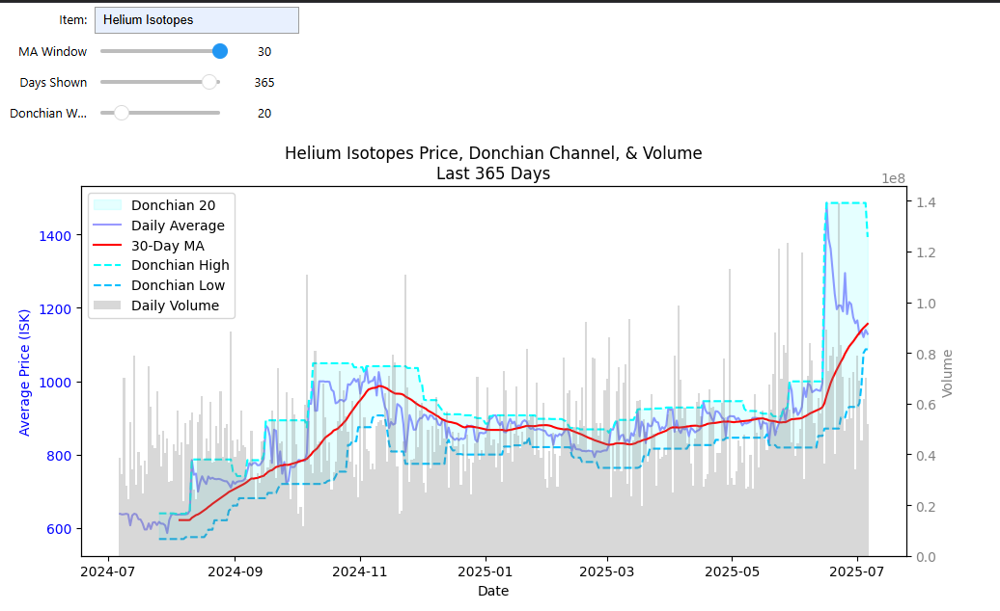
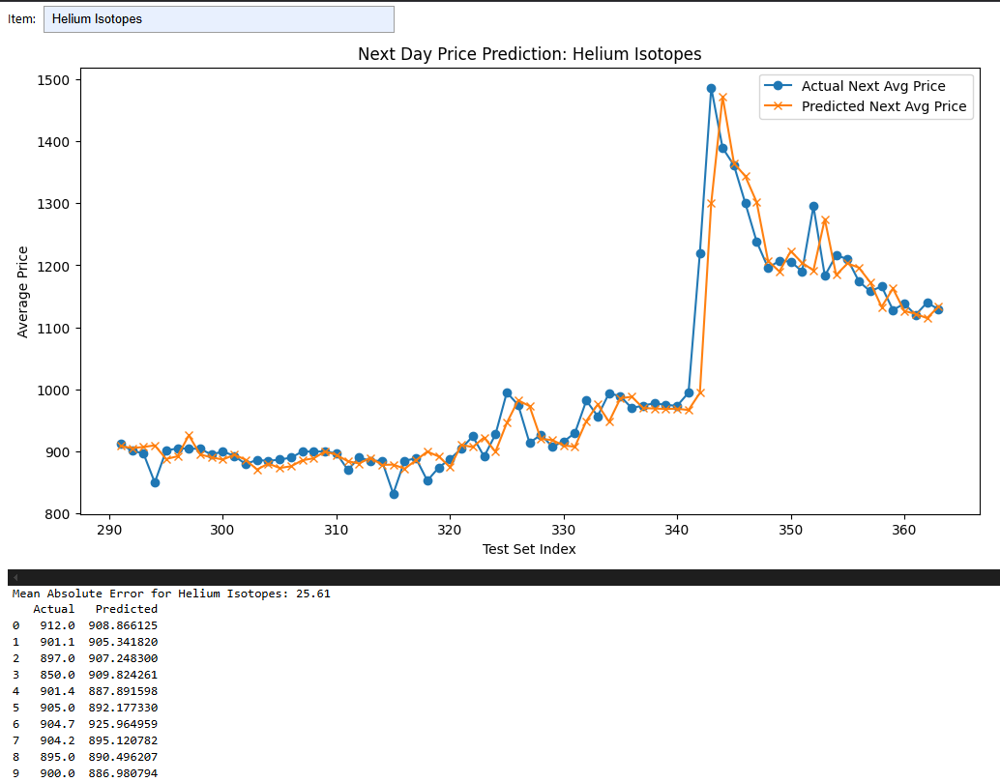

# EVE Market Logger

EVE Market Logger is a data analysis project focused on station trading at Jita 4-4 in EVE Online. It uses the EVE Swagger Interface (ESI) API to fetch market data, stores it in a PostgreSQL database, and analyzes trade performance using Python and Jupyter.

This project simulates the operations of an investment trader.

## Objectives

- Automate and merge market data using the ESI API
- Analyze trade performance, liquidity, and market behavior
- Apply real data analyst practices in a game economy

## Tech Stack

- Python 3.12  
- PostgreSQL 17.5  
- pandas, psycopg2, matplotlib, scikit-learn  
- Jupyter Notebooks  
- EVE Swagger Interface (ESI API)  
- VS Code on Windows 11 with PowerShell

## Data Workflow

1. Use Python scripts to query the ESI API  
2. Analyze with Jupyter notebooks:  
   - Liquidity  
   - Profit margins  
   - ISK velocity  
   - Inventory aging  
   - Capital allocation

## Roadmap

| Feature / Task                           | Status        | Target Version  | Notes                                                |
|------------------------------------------|---------------|-----------------|------------------------------------------------------|
| **Data Ingestion & Storage**             |               |                 |                                                      |
| Fetch market data via ESI API            | Complete      | v0.1            | Scripts to automate fetching implemented             |
| Store data in PostgreSQL database        | Complete      | v0.1            | Database schema in place                             |
| Automate data fetching (scheduling)      | In Progress   | v0.2            | Cron job or task scheduler setup planned             |
| Improve item type and backlog management | Planned       | v0.3            | Sanitize and track more items over time              |
| **Data Analysis & Visualization**        |               |                 |                                                      |
| Develop Jupyter notebooks for analysis   | In Progress   | v0.2            | Analyze liquidity, profit margins, ISK velocity, etc.|
| Add interactive widgets to notebooks     | In Progress       | v0.3            | Use `ipywidgets` for dynamic exploration             |
| Summary dashboards/reports (Streamlit)   | Planned       | v0.4            | BI reports for trade performance and market trends   |
| Scale analysis fully in Postgres         | Planned       | v0.4            | Transition analysis scripts from CSV to Postgres     |
| **Data Quality & Reliability**           |               |                 |                                                      |
| Expand error handling and logging        | Planned       | v0.3            | Robust exception handling for API and DB ops         |
| Document all scripts and data flows      | Planned       | v0.3            | Improve onboarding and contributor experience        |

## References

- EVE ESI API: https://esi.evetech.net/ui/

